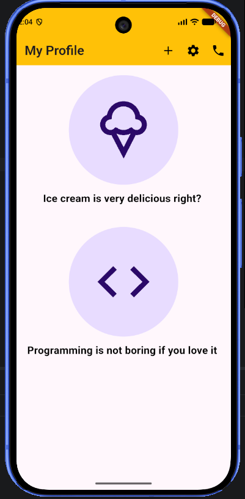

# My Profile UI

A simple **My Profile UI** built with Flutter and Dart.
This project demonstrates how to use basic Flutter widgets such as Scaffold, AppBar, Container, Column, Text, Icon, IconButton, and SizedBox.

## UI Preview

## Features

* Custom AppBar with Add, Settings, and Phone buttons
* Circular Ice Cream and Programming sections
* Custom colors and styling
* Simple Flutter layout using `Column`, `Container`, `Text`, and `Icon`

## Technologies

* Flutter
* Dart

## Author

Monisha Hossain
